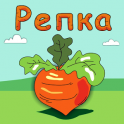

# Repka

## Icon

## Author

Created on 11/2014 by **Kirill Rodriguez**. At least the 1st of November is what metadata of the earliest tarball I made of this project says.

## Program

This is a simple TBS 2D strategy game vaguely resembling the rock-paper-scissors. Each of the players has a headquarters and money, which they use for destroying the opponents base.

I called it "Repka" as it looks very village-like, so somehow it reminds me of the fairy tale "The Great Turnip" (which is "Repka" in Russian).

This game is still very raw (although very funny when you launch it) and can not yet compete with more advanced stuff like noughs&crosses etc.

## Tools

* CXX compiler
* GLUT/OpenGL
* CMake

## Usage

To compile the program, execute:

    ./link
    ./compile

Or alternatively:

    cmake .
    make

To run the program, use:

    ./_repka

## Screenshots

### Rush

### Creep

### Chasing

